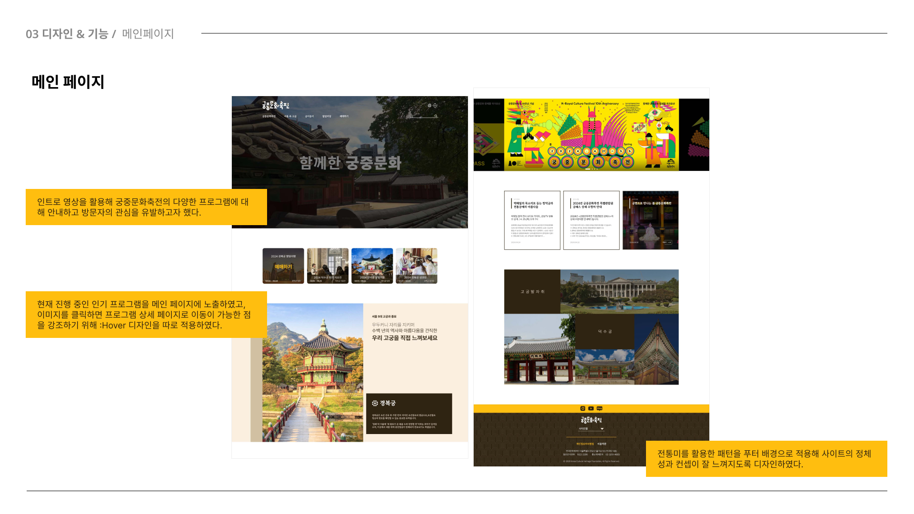
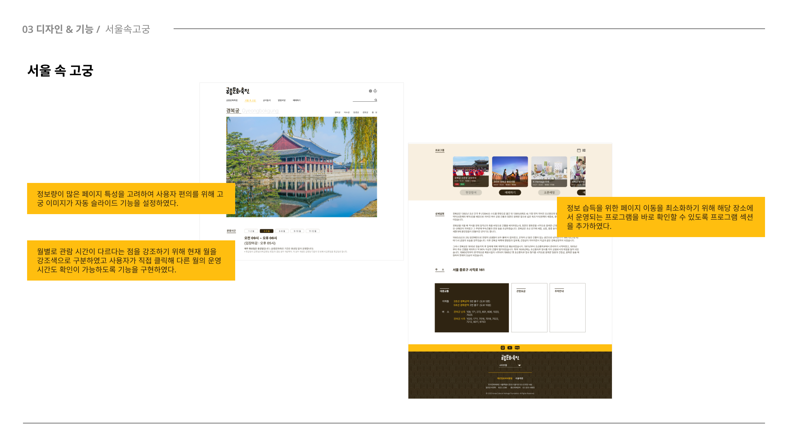
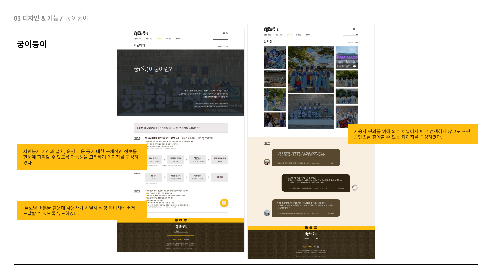
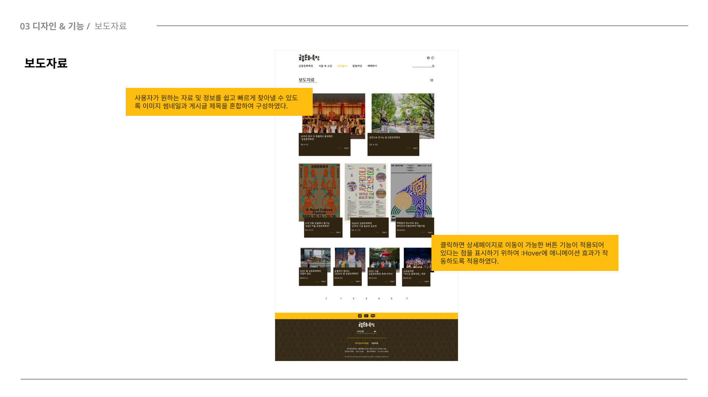
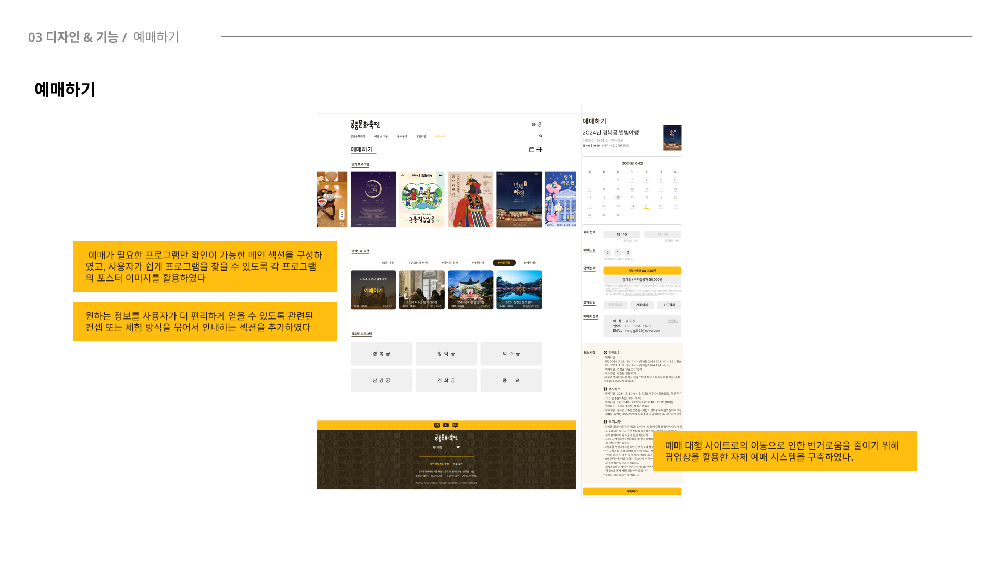

# 💻궁중문화축전 반응형 웹페이지 리뉴얼

## 📂About
**제작 기간** 　 2024.04.15 ~ 2024.06.02 
**참여 인원** 　 이희진, 임규성, 조한나

  

## 📂페이지 선정 이유

‘궁중문화축전’은 대한민국을 대표하는 문화유산이자 조선과 대한제국의 역사를 품고 있는 
경복궁, 창덕궁, 창경궁, 덕수궁, 경희궁 등 서울 소재 5개의 궁궐과 종묘에서 펼쳐지는 <b>국내 최대 문화유산 축제</b>입니다.
 

올해로 10년째 이어져 오고 있는 ‘궁중문화축전’의 
다양한 문화 · 예술 프로그램을 더 많은 사람들이 쉽고 편하게 즐기게 하고자 하였습니다.

  

## 📂일정표

|작   업|작업기간|내   용|
|:--:|:--:|:--:|
|기획 & 와이어프레임|4/15(월) ~ 4/21(일)|문제점 발견 및 해결방안 도출, 와이어프레임 제작|
|디자인|4/22(월) ~ 4/28(일)|웹페이지 UI 디자인 시안 제작|
|디자인 보완 & 수정|4/29(월) ~ 5/12(일) |디자인 시안 피드백 및 수정 반영|
|HTML & CSS|5/13(월) ~ 5/21(화)|구조 및 스타일 구현|
|Java Script & jQuery|5/22(수) ~ 6/2(일)|기능 및 애니메이션 구현|

  

## 📂기획안 & Design Guide
[🔗기획서로 연결](https://www.figma.com/design/uGumpecuNzkSPzbOUazflF/%5B%EC%B5%9C%EC%A2%85%5D%EA%B6%81%EC%A4%91%EB%AC%B8%ED%99%94%EC%B6%95%EC%A0%84-%EA%B8%B0%ED%9A%8D%EC%84%9C_240708?node-id=0-1&t=hn1de7QhfDOQl51q-1)

  

## 📂페이지의 구성과 동작

